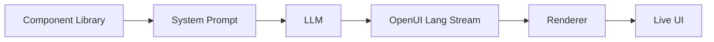

<div align="center">

<a href="https://www.openui.com" target="_blank" rel="noopener noreferrer">
  
</a>

# OpenUI - The Open Standard for Generative UI

<p align="center">
  <a href="https://github.com/thesysdev/openui/actions/workflows/build-js.yml"></a>
  <a href="./LICENSE"></a>
  <a href="https://discord.com/invite/Pbv5PsqUSv"></a>
</p>

<a href="https://trendshift.io/repositories/22357" target="_blank"></a>

</div>

OpenUI is a full-stack Generative UI framework: a compact streaming-first language, a React runtime with built-in component libraries, and ready-to-use chat interfaces that are up to 67% more token-efficient than JSON.

<div align="center">

[Docs](https://openui.com) · [Playground](https://www.openui.com/playground) · [Discord](https://discord.com/invite/Pbv5PsqUSv) · [Contributing](./CONTRIBUTING.md)

</div>

> **Important:** OpenUI has no official cryptocurrency, token, or coin. Any asset using the OpenUI name is unaffiliated with this project and is not endorsed by its maintainers.

---

## What is OpenUI

<div align="center">


</div>

At the center of OpenUI is **OpenUI Lang**: a compact, streaming-first language for model-generated UI. Instead of treating model output as only text, OpenUI lets you define components, generate prompt instructions from that component library, and render structured UI as the model streams.

**Core capabilities:**

- **OpenUI Lang** - A compact language for structured UI generation designed for streaming output.
- **Built-in component libraries** - Charts, forms, tables, layouts, and more, ready to use or extend.
- **Prompt generation from your component library** - Generate model instructions directly from the components you allow.
- **Streaming renderer** - Parse and render model output progressively in React as tokens arrive.
- **Chat and app surfaces** - Use the same foundation for assistants, copilots, and broader interactive product flows.

## Quick Start

```bash
npx @openuidev/cli@latest create --name genui-chat-app
cd genui-chat-app
echo "OPENAI_API_KEY=sk-your-key-here" > .env
npm run dev
```

This is the fastest way to start with OpenUI. The scaffolded app gives you an end-to-end starting point with streaming, built-in UI, and OpenUI Lang support.

What this gives you:

- **OpenUI Lang support** - Start with structured UI generation built into the app flow.
- **Library-driven prompts** - Generate instructions from your allowed component set.
- **Streaming support** - Update the UI progressively as output arrives.
- **Working app foundation** - Start from a ready-to-run example instead of wiring everything manually.

## How it works

Your components define what the model can generate.



1. Define or reuse a component library.
2. Generate a system prompt from that library.
3. Send that prompt to your model.
4. Stream OpenUI Lang output back to the client.
5. Render the output progressively with Renderer.

Try it yourself in the [Playground](https://www.openui.com/playground): generate UI live with the default component library.

## Packages

| Package                                                                                                    | Best for                                         | Description                                                                                                  |
| :--------------------------------------------------------------------------------------------------------- | :----------------------------------------------- | :----------------------------------------------------------------------------------------------------------- |
| [`@openuidev/lang-core`](./packages/lang-core)                                                             | Framework-agnostic parsing and prompt generation | Core parser, prompt-generation, runtime-evaluation, and type layer with no React, Vue, or Svelte dependency  |
| [`@openuidev/react-lang`](./packages/react-lang)                                                           | React rendering runtimes                         | Define component libraries, generate prompts, and render streamed OpenUI Lang in React                       |
| [`@openuidev/react-headless`](./packages/react-headless)                                                   | Bring-your-own React chat UI                     | Headless chat state, streaming adapters, and message format converters                                       |
| [`@openuidev/react-ui`](./packages/react-ui)                                                               | Fastest path to a full React chat experience     | Prebuilt chat layouts, standalone UI primitives, and two built-in component libraries                        |
| [`@openuidev/react-email`](./packages/react-email)                                                         | Email generation and HTML export                 | React Email component definitions plus prompt options for model-generated emails                             |
| [`@openuidev/vue-lang`](./packages/vue-lang)                                                               | Vue integrations                                 | Vue 3 bindings for defining model-renderable components and rendering streamed OpenUI Lang                   |
| [`@openuidev/svelte-lang`](./packages/svelte-lang)                                                         | Svelte integrations                              | Svelte 5 bindings for defining model-renderable components and rendering streamed OpenUI Lang                |
| [`@openuidev/browser-bundle`](./packages/browser-bundle)                                                   | CDN, iframe, and no-build embeds                 | Prebuilt browser bundle that ships the renderer, UI library, React, and styles as script + stylesheet assets |
| [`@openuidev/cli`](./packages/openui-cli)                                                                  | Project scaffolding and prompt generation        | CLI for creating new apps and generating system prompts or JSON schema from a library definition             |
| [`@openuidev/openclaw-os-plugin`](https://github.com/thesysdev/openclaw-os/tree/main/packages/claw-plugin) | OpenClaw workspaces                              | OpenClaw OS plugin for serving OpenUI-powered OpenClaw workspaces                                            |

Common starting points:

```bash
# React app with OpenUI rendering and prebuilt components
npm install @openuidev/react-lang @openuidev/react-ui

# Framework-agnostic backend or Edge prompt generation
npm install @openuidev/lang-core

# Vue or Svelte runtime
npm install @openuidev/vue-lang
npm install @openuidev/svelte-lang
```

## Why OpenUI Lang

OpenUI Lang is designed for model-generated UI that needs to be both structured and streamable.

- **Streaming output** - Emit UI incrementally as tokens arrive.
- **Token efficiency** - Up to 67% fewer tokens than equivalent JSON (see [benchmarks](./benchmarks)).
- **Controlled rendering** - Restrict output to the components you define and register.
- **Typed component contracts** - Define component props and structure up front with Zod schemas.

### Token efficiency benchmarks

Measured with `tiktoken` (GPT-5 encoder). OpenUI Lang vs two JSON-based streaming formats across seven UI scenarios:

| Scenario           | Vercel JSON-Render | Thesys C1 JSON | OpenUI Lang |  vs Vercel |      vs C1 |
| ------------------ | -----------------: | -------------: | ----------: | ---------: | ---------: |
| simple-table       |                340 |            357 |         148 |     -56.5% |     -58.5% |
| chart-with-data    |                520 |            516 |         231 |     -55.6% |     -55.2% |
| contact-form       |                893 |            849 |         294 |     -67.1% |     -65.4% |
| dashboard          |               2247 |           2261 |        1226 |     -45.4% |     -45.8% |
| pricing-page       |               2487 |           2379 |        1195 |     -52.0% |     -49.8% |
| settings-panel     |               1244 |           1205 |         540 |     -56.6% |     -55.2% |
| e-commerce-product |               2449 |           2381 |        1166 |     -52.4% |     -51.0% |
| **TOTAL**          |          **10180** |       **9948** |    **4800** | **-52.8%** | **-51.7%** |

Full methodology and reproduction steps in [`benchmarks/`](./benchmarks).

## Documentation

Detailed documentation is available at [openui.com](https://openui.com).

## Repository structure

```
openui/
├── packages/
│   ├── react-lang/       # Core runtime (parser, renderer, prompt generation)
│   ├── react-headless/   # Headless chat state & streaming adapters
│   ├── react-ui/         # Prebuilt chat layouts & component libraries
│   ├── react-email/      # React Email component library for generated emails
│   ├── lang-core/        # Framework-agnostic parser, prompt, and runtime layer
│   ├── vue-lang/         # Vue runtime bindings for OpenUI Lang
│   ├── svelte-lang/      # Svelte runtime bindings for OpenUI Lang
│   ├── browser-bundle/   # Script-tag bundle for CDN / iframe / no-build embeds
│   └── openui-cli/       # CLI for scaffolding & prompt generation
├── skills/
│   └── openui/           # Claude Code skill for AI-assisted development
├── examples/
│   └── openui-chat/      # Full working example app (Next.js)
├── docs/                 # Documentation site (openui.com)
└── benchmarks/           # Token efficiency benchmarks
```

Good places to start:

- [openui.com](https://openui.com) for the full docs
- [`examples/openui-chat`](./examples/openui-chat) for a working app
- [`CONTRIBUTING.md`](./CONTRIBUTING.md) if you want to contribute

## Community

- [Discord](https://discord.com/invite/Pbv5PsqUSv) - Ask questions, share what you're building
- [GitHub Issues](https://github.com/thesysdev/openui/issues) - Report bugs or request features

## How OpenUI compares

| Feature                |             OpenUI |           json-render (Vercel) |     A2UI (Google) | CopilotKit OpenGenUI |
| ---------------------- | -----------------: | -----------------------------: | ----------------: | -------------------: |
| Tokens                 |                 1x |                             3x |                3x |                   4x |
| Latency (60 tok/s)     |               4.9s |                          14.2s |             14.2s |                 ~20s |
| Streaming              |                Yes |                            Yes |               Yes |              Partial |
| Consistent output      |                Yes |                            Yes |               Yes |                   No |
| Components             |   Library + custom |               Library + custom |       Custom only |                 None |
| Multi-platform         | Web, mobile, email | Web, mobile, PDF, email, video | Web, iOS, Android |                  Web |
| Built-in data fetching |                Yes |                             No |                No |                   No |
| Chat UI included       |                Yes |                             No |                No |                  Yes |

For more details, refer to the official [OpenUI Lang comparison documentation](https://www.openui.com/docs/openui-lang/comparison).

## Adopters

A list of organizations and projects using OpenUI is maintained in [`ADOPTERS.md`](./ADOPTERS.md). If you're using OpenUI, please consider adding your organization; it helps the project gain momentum and helps other adopters find peers using OpenUI in similar contexts.

## Contributing

Contributions are welcome. See [`CONTRIBUTING.md`](./CONTRIBUTING.md) for contribution guidelines and ways to get involved.

## Agent Skill

OpenUI ships an [Agent Skill](https://agentskills.io) so AI coding assistants (Claude Code, Codex, Cursor, Copilot, etc.) can help you scaffold, build, and debug Generative UI apps using OpenUI Lang.

### Install

```bash
# With the skills CLI (works across all agents)
npx skills add thesysdev/openui --skill openui

# Manual - copy into your project
cp -r skills/openui .claude/skills/openui
```

The skill covers component library design, OpenUI Lang syntax, system prompt generation, the Renderer, SDK packages, and debugging malformed LLM output.

## Star History

<a href="https://www.star-history.com/?repos=thesysdev%2Fopenui&type=date&legend=top-left">
 <picture>
   <source media="(prefers-color-scheme: dark)" srcset="https://api.star-history.com/chart?repos=thesysdev/openui&type=date&theme=dark&legend=top-left" />
   <source media="(prefers-color-scheme: light)" srcset="https://api.star-history.com/chart?repos=thesysdev/openui&type=date&legend=top-left" />
   
 </picture>
</a>

## License

This project is available under the terms described in [`LICENSE`](./LICENSE).
